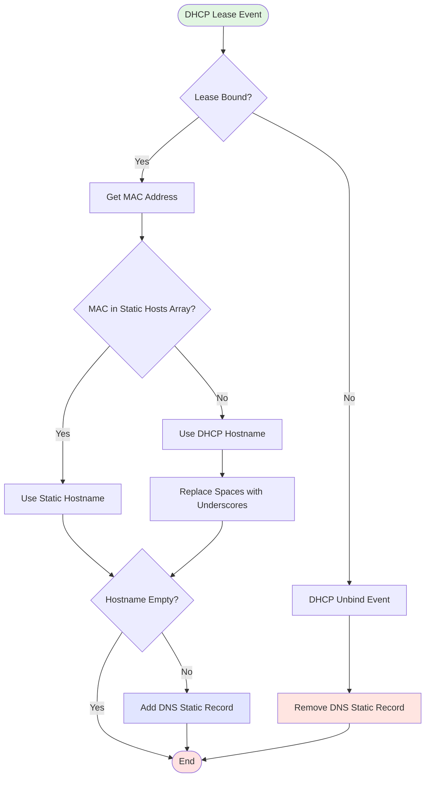

#Mikotik #DHCP #DNS

# Mikrotik: Updating DNS Static Records from DHCP

Technical Guide

This document describes how to automatically create and remove static DNS records in MikroTik RouterOS based on DHCP lease events.
The solution uses a DHCP lease script and a global variable containing predefined hostname mappings.

---

## Overview

When a DHCP client receives or releases an IP address, the DHCP server runs a script that:
  • Determines the hostname:
  • Either from a predefined MAC → hostname mapping
  • Or from the lease-hostname option (sanitized)
  • Creates or removes a static DNS A record in /ip/dns/static
  • Logs all operations

All code blocks are provided in native MikroTik RouterOS Script language.



---

## Usage

### DHCP Server Configuration

Add a DHCP server and attach the DNS update script using the lease-script property.

dhcp-server-script.png)

---

### Global Variables

A global variable hosts stores a mapping of **MAC addresses** to **custom static hostnames**.

```mikrotik
# DHCP to DNS
:global hosts {
  "C8:D7:78:73:11:11"="dishwasher";
  "70:C9:32:39:11:11"="dreame";
  "00:15:5D:0A:11:11"="winsrv-2022"}
```

This mapping has priority over the `lease-hostname` provided by the DHCP client.

#### Global variables script

initGlobalVars script template here:

```mikrotik
/system script
  add name=initGlobalVars \
  comment="Initialize global variables" \
  dont-require-permissions=no \
  policy=read,write,policy,test \
  source="# Put global variable initialization code here"
```

##### Initialization Scheduler

Add a scheduler task that loads global variables during system startup.

```mikrotik
/system scheduler
	add name=loadGlobals \
	start-time=startup \
	policy=read,write,policy,test \
	comment="Initialize global variables on startup" \
	on-event="\
	/system/script/run initGlobalVars;"
```

---
https://github.com/vkushnir/mikrotik-scripts/tree/main/ip/dhcp

